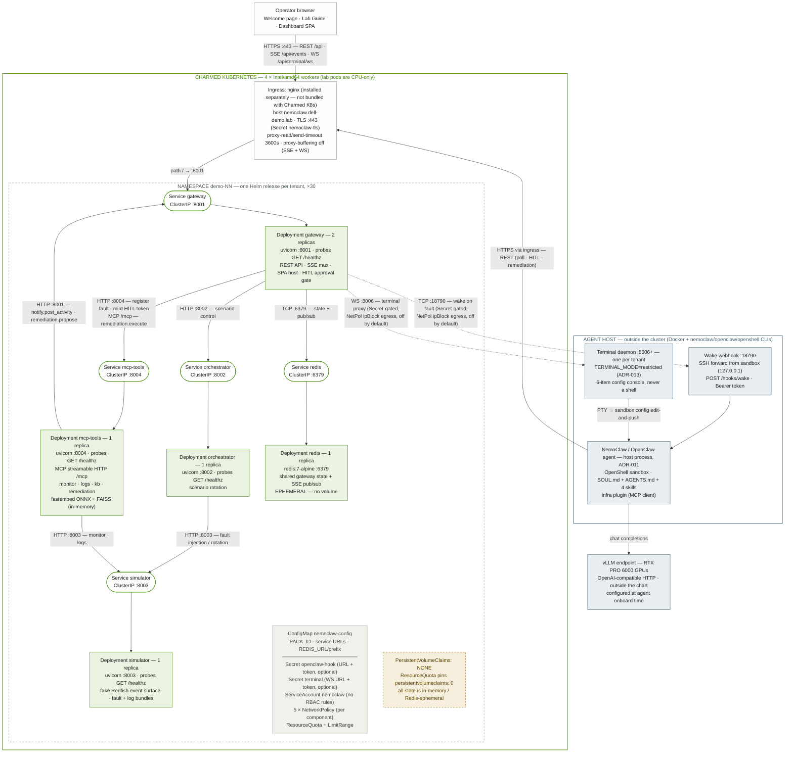

# NemoClaw Lab on Charmed Kubernetes — Architecture

As rendered by the Helm chart (`deploy/helm/nemoclaw/`) with `values.prod.yaml`:
4-node Intel/amd64 Charmed K8s cluster, one namespace per demo tenant (up to 30
via `deploy/scripts/provision-demo-namespaces.sh`). The autonomous agent, its
terminal daemons, and the vLLM endpoint deliberately live **outside** the
cluster (ADR-011 / ADR-013).

## System map — one tenant namespace

Solid arrows are steady-state HTTP/TCP flows; dashed arrows are optional,
secret-gated flows that are off by default. Every in-cluster Service is
ClusterIP; the only way in is the ingress.

Legend: green-filled = Pod/Deployment · white/green-bordered = ClusterIP
Service · slate = host process outside the cluster · grey = config/policy
objects · amber dashed = deliberate absence.

## Ports at a glance

Every in-cluster port is ClusterIP-only; nothing is NodePort or LoadBalancer.
External ports live on the agent host.

| Port     | Where                   | Carries                                                                  |
|----------|-------------------------|--------------------------------------------------------------------------|
| `443`    | Ingress (nginx)         | TLS for `nemoclaw.dell-demo.lab` — REST, SSE, terminal WS                 |
| `8001`   | gateway pods + Service  | REST API, SSE `/api/events`, SPA, HITL tokens, WS proxy                   |
| `8002`   | orchestrator            | Scenario rotation control (from gateway only)                             |
| `8003`   | simulator               | Fake Redfish events (from orchestrator + mcp-tools)                       |
| `8004`   | mcp-tools               | MCP streamable HTTP `/mcp` + REST (from gateway only)                     |
| `6379`   | redis                   | Shared state + SSE pub/sub (from gateway only)                            |
| `53/udp` | cluster DNS             | Allowed egress from every policy'd pod                                    |
| `18790`  | agent host              | Wake webhook `POST /hooks/wake` (gateway egress, secret-gated)            |
| `8006+`  | agent host              | Per-tenant restricted terminal WS (gateway egress, secret-gated)          |

## NetworkPolicy matrix

One policy per component; default posture is deny-outside-the-list. All allow
DNS egress on 53/udp.

| Pod            | Ingress from             | Egress to                                                                              |
|----------------|--------------------------|-----------------------------------------------------------------------------------------|
| `gateway`      | anywhere (demo ingress)  | orchestrator, mcp-tools, redis; + ipBlock `:18790` / `:8006` when hook/terminal secrets are set |
| `orchestrator` | gateway only             | simulator                                                                                |
| `mcp-tools`    | gateway only             | simulator, gateway (activity + proposals, ADR-010)                                       |
| `simulator`    | orchestrator, mcp-tools  | DNS only                                                                                 |
| `redis`        | gateway only             | none                                                                                     |

## Per-namespace object inventory

Rendered by one Helm release (`values.prod.yaml`, registry
`registry.nemoclaw.lab`).

| Kind           | Objects                                                                                          |
|----------------|--------------------------------------------------------------------------------------------------|
| Deployment     | gateway ×2 replicas, orchestrator, mcp-tools, simulator, redis (1 each)                            |
| Service        | 5 × ClusterIP (gateway, orchestrator, mcp-tools, simulator, redis)                                 |
| Ingress        | gateway only — class `nginx`, TLS via `nemoclaw-tls`                                               |
| ConfigMap      | `-config`: PACK_ID + intra-namespace service URLs + Redis DSN/prefix, `envFrom` into all app pods  |
| Secret         | `-openclaw-hook`, `-terminal` (each rendered only when URL+token set), `nemoclaw-tls`              |
| NetworkPolicy  | 5 (matrix above)                                                                                   |
| ResourceQuota  | 4 CPU / 6 Gi requests, 8 CPU / 12 Gi limits, 20 pods, 10 services, **0 PVCs**                      |
| LimitRange     | container default 500m/512Mi, max 4 CPU / 8 Gi                                                     |
| ServiceAccount | `nemoclaw` — no K8s API permissions needed                                                         |
| PVC            | **None, by design** — quota enforces it; Redis is ephemeral, FAISS/fastembed rebuild at pod start  |

## Host processes (outside the cluster)

ADR-011: the agent stack needs Docker + the `nemoclaw`/`openclaw`/`openshell`
CLIs, so it runs as peer host processes, not pods.

| Process                     | Role                                                                                                     |
|-----------------------------|-----------------------------------------------------------------------------------------------------------|
| OpenClaw agent sandbox      | One OpenShell sandbox per tenant; polls/receives faults, analyses logs via LLM, proposes remediation through the gateway's HITL gate |
| Wake-hook listener `:18790` | SSH forward published by openshell; gateway POSTs here on fault injection — best-effort, agent falls back to cron poll |
| Terminal daemon `:8006+`    | `run-terminal-tenant.sh <tenant> <sandbox> <port>` — one restricted-console daemon per tenant, unique port each |
| vLLM server                 | Serves the local LLM on the RTX PRO 6000 GPUs; credentials configured at agent onboard time, never via Helm |

## Deployment caveats worth knowing

- **Charmed K8s ships no ingress controller.** Deploy ingress-nginx (or
  equivalent) first and verify with `kubectl get ingressclass` — an Ingress
  with an unmatched class is silently never served. The SSE/WS timeout +
  no-buffering annotations are load-bearing: nginx defaults kill the
  dashboard's event stream at 60s.
- **Gateway runs 2 replicas only because Redis exists.** Replicas share
  HITL/state via Redis and fan SSE out over pub/sub; without Redis, scaling
  the gateway would split state.
- **Hook and terminal are fail-safe off.** Both secrets render only when URL +
  token are set at deploy time; without them the agent simply polls (slower
  but functional) and the embedded terminal stays hidden. Narrow the
  corresponding NetworkPolicy `egressCidr` to the agent host's /32.
- **Agent → MCP Tools goes through the ingress `/mcp` path + agent-host
  proxy.** With `mcpTools.exposeMcp: true` (on in values.prod.yaml), the
  gateway ingress routes **only** `/mcp` to mcp-tools (its `/internal/*`
  surface stays cluster-only) and the NetworkPolicy admits the ingress
  controller on 8004 from `mcpTools.mcpIngressCidr` — narrow that to the
  controller/node CIDR. On the agent host, `deploy/scripts/run-lab-proxy.sh`
  renders an nginx listener pair (default :8004/:8001, per-tenant pairs for
  M9) that forwards to the ingress over TLS, because the sandbox may only
  egress to `host.openshell.internal` (the one host NemoClaw policy presets
  may pin) and speaks plain HTTP to it. Onboard with
  `MCP_PORT`/`GATEWAY_PORT` matching the proxy ports.
  **Do not use `nemoclaw mcp add` for the internal endpoints** — its
  private-IP SSRF guard is hardcoded with no flag, env var, or config
  override, and it rejects the `host.openshell.internal` alias for MCP by
  design (see docs/TROUBLESHOOTING.md). Skipping NemoClaw's managed MCP
  bridge costs only its credential-replacement feature, which this stack
  doesn't use: mcp-tools has no client credential, and `remediation.execute`
  stays gated by the gateway-minted HITL token. K8s-native agent integration
  remains deferred by ADR-011's scope note.
- **Images must be amd64.** The Makefile default targets the arm64 GB10 dev
  host — build with `make push PLATFORM=linux/amd64` for the Intel workers.

---

*Derived from `deploy/helm/nemoclaw/` (chart v0.1.0, `values.prod.yaml`),
`deploy/scripts/`, and ADR-010/011/012/013.*
